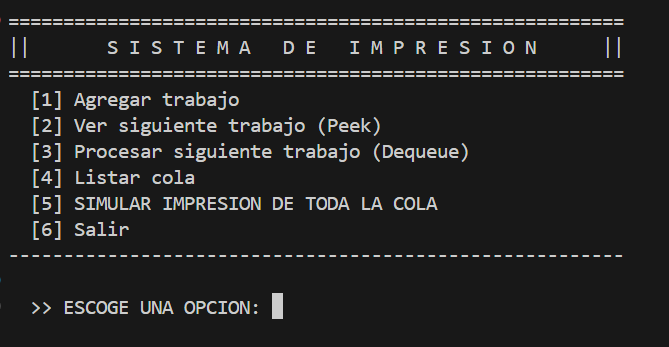
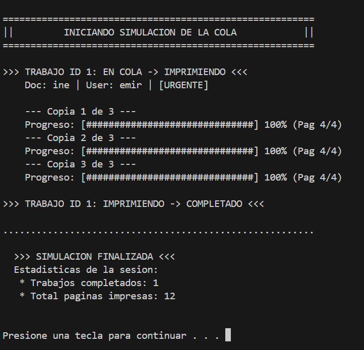

# Práctica 01: Cola de impresión en lenguaje C

## Introducción

En los sistemas informáticos modernos la administración de tareas es un aspecto fundamental para garantizar un flujo ordenado de trabajo. Un ejemplo cotidiano de esto es el manejo de trabajos de impresión en una impresora compartida. Cuando varios usuarios envían documentos al mismo tiempo el sistema necesita una estructura que permita organizar dichos trabajos de forma eficiente.

Para resolver este problema se utiliza una **cola (queue)** que es una estructura de datos que sigue el principio **FIFO (First In, First Out)**, lo que significa que el primer elemento que entra es el primero en salir. Este comportamiento es ideal para representar procesos como filas de atención, solicitudes en servidores y colas de impresión.

En esta práctica se desarrolló un **simulador de cola de impresion** el cual fue implementado en tres sesiones progresivas. En la primera sesión se implementó una cola utilizando memoria estática mediante arreglos. Posteriormente en la segunda etapa se migró la estructura a memoria dinámica utilizando listas enlazadas y manejo de memoria con `malloc` y `free`. Finalmente en la tercera sesion se agregó una simulación completa del proceso de impresión incluyendo progreso por páginas, manejo de prioridades y estadísticas del sistema.

El objetivo principal de esta práctica fue comprender el funcionamiento de las estructuras de datos tipo cola y reforzar conceptos fundamentales del lenguaje C **alcance de variables, manejo de memoria, uso de estructuras, enumeraciones y diseño de funciones**.

---

## Diseño del sistema

### Estructura del trabajo de impresión

El sistema se basa en una estructura llamada `Trabajo`, la cual representa un trabajo de impresión enviado por un usuario.

```c
typedef struct Trabajo
{
    int id;
    char usuario[32];
    char documento[42];
    int total_pgs;
    int restante_pgs;
    int copias;

    enum prioridad
    {
        NORMAL,
        URGENTE
    } Prioridad;

    enum estado
    {
        EN_COLA,
        IMPRIMIENDO,
        COMPLETADO,
        CANCELADO
    } Estado;

} Trabajo;
```

Cada campo de la estructura cumple una función específica dentro del sistema:

- **id**: identificador único del trabajo de impresión.
- **usuario**: nombre del usuario que envía el documento.
- **documento**: nombre del archivo a imprimir.
- **total_pgs**: número total de páginas del documento.
- **restante_pgs**: páginas restantes durante la simulación de impresión.
- **copias**: cantidad de copias que se deben imprimir.
- **Prioridad**: indica si el trabajo es normal o urgente.
- **Estado**: indica el estado actual del trabajo.

El uso de **estructuras (`struct`)** permite agrupar información relacionada en una sola entidad lógica, mientras que el uso de **enumeraciones (`enum`)** facilita representar estados o categorías de forma clara y legible.

---

## Implementación

### Sesión 1: Cola con memoria estática

En la primera etapa se implementó una cola utilizando un arreglo fijo de tamaño 10. Esta implementación es sencilla y eficiente para sistemas pequeños, aunque tiene la limitación de que el tamaño máximo está determinado desde el inicio.

La estructura de la cola se define de la siguiente forma:

```c
typedef struct
{
    Trabajo trabajos[10];
    int frente;
    int final;
    int tamano;
    int sig_id;

} Cola;
```

Los campos principales son:

- **trabajos**: arreglo que almacena los trabajos de impresión.
- **frente**: índice del primer elemento de la cola.
- **final**: índice del último elemento insertado.
- **tamano**: cantidad actual de elementos.
- **sig_id**: contador para generar identificadores únicos.

Las operaciones principales implementadas fueron:

- `enqueue`: agrega un nuevo trabajo a la cola.
- `dequeue`: elimina el trabajo del frente de la cola.
- `peek`: consulta el siguiente trabajo sin eliminarlo.
- `print`: muestra todos los trabajos de la cola.

Esta versión utiliza una **cola circular**, lo que permite reutilizar posiciones del arreglo cuando se eliminan elementos.

Ventajas de esta implementación:

- Fácil de implementar.
- No requiere manejo manual de memoria.

Limitaciones:

- Tamaño fijo.
- No permite crecer dinámicamente.

---

### Sesión 2: Cola con memoria dinámica

En la segunda etapa el sistema fue modificado para utilizar memoria dinámica mediante una lista enlazada.

Se definió la estructura de nodo de la siguiente forma:

```c
typedef struct Nodo
{
    Trabajo trabajo;
    struct Nodo *sig;
} Nodo;
```

Cada nodo contiene un trabajo de impresión y un puntero al siguiente nodo de la lista.

La cola se define así:

```c
typedef struct
{
    Nodo *frente;
    Nodo *final;
    int tamano;
    int sig_id;
} Cola;
```

En esta implementación los nodos se crean dinámicamente usando:

```c
Nodo *nuevo = (Nodo *)malloc(sizeof(Nodo));
```

Cuando un trabajo se procesa y se elimina de la cola la memoria se libera mediante:

```c
free(temp);
```

Además se implementó la función `qd_destroy()` para liberar toda la memoria utilizada antes de que el programa termine.

Ventajas de esta implementación:

- La cola puede crecer dinámicamente.
- No existe un límite fijo de trabajos.

Desventajas:

- Se requiere manejo manual de memoria.
- Existe riesgo de fugas de memoria si no se usa `free`.

---
### Sesión 3: Progreso y Delay
---
En la tercera etapa se agregó una simulación completa del proceso de impresión.

La función `simular_impresion()` se encarga de procesar cada trabajo página por página, simulando el comportamiento mecánico de una impresora real.

```c
void simular_impresion(Trabajo *t)
{
    printf("\n>>> Trabajo ID %d: EN COLA -> IMPRIMIENDO <<<\n", t->id);
    t->Estado = IMPRIMIENDO;

    printf("Documento: %s | Usuario: %s | [%s]\n",
           t->documento, t->usuario, t->Prioridad == URGENTE ? "URGENTE" : "NORMAL");

    for (int c = 1; c <= t->copias; c++)
    {
        if (t->copias > 1)
        {
            printf("- Copia %d de %d -\n", c, t->copias);
        }

        for (int i = 1; i <= t->total_pgs; i++)
        {
            printf("  Imprimiendo pagina %d de %d...\n", i, t->total_pgs);
            Sleep(400);
            t->restante_pgs--;
        }
    }

    t->Estado = COMPLETADO;
    printf(">>> Trabajo ID %d: IMPRIMIENDO -> COMPLETADO <<<\n\n", t->id);
}

```

**Avance de progreso y retardo**
Durante la simulación el sistema realiza lo siguiente:

1. **Cambio de estado:** Cambia el estado del trabajo a **IMPRIMIENDO**.
2. **Ciclo de impresión:** Utiliza bucles anidados para iterar primero sobre la cantidad de copias y luego sobre cada página del documento.
3. **Retardo simulado (Delay):** Se utiliza la función `Sleep(400)` (perteneciente a la biblioteca `windows.h`) para pausar la ejecución del programa durante 400 milisegundos entre cada iteración. Esto representa el tiempo físico que tarda una impresora en procesar y expulsar una hoja.
4. **Progreso de páginas:** En cada iteración, la instrucción `t->restante_pgs--` reduce el contador de páginas restantes directamente en la estructura del trabajo, lo que permite llevar un registro exacto del progreso.
5. **Finalización:** Al terminar los ciclos, cambia el estado final a **COMPLETADO**.

También se agregó una función que procesa todos los trabajos de la cola, `simular_cola_completa(Cola *cola)`, la cual extrae y procesa cada trabajo hasta que la cola queda vacía.

---

### Preguntas Guía

* **¿Dónde se guardó el contador de ID?**
    El contador `sig_id` se guardó directamente dentro de la estructura `Cola` . Esto garantiza que el contador sea persistente.

* **¿Qué función libera memoria?**
    En la implementación dinámica la memoria de los nodos individuales se libera utilizando la función `free()` dentro de la operación `dequeue()`. Adicionalmente se cuenta con una función dedicada llamada `qd_destroy()` que recorre todos los nodos remanentes en la cola al finalizar el programa y los libera uno por uno para evitar fugas de memoria.

* **Invariantes de la cola**
    
    Para garantizar que la estructura funcione correctamente se cumplen las siguientes invariantes:
    1.  El elemento apuntado por `frente` es siempre el más antiguo del sistema (el próximo a salir).
    2.  Las inserciones ocurren estrictamente a través del puntero `final`.
    3.  La variable `tamano` siempre refleja la cantidad exacta de elementos activos en la cola.
    4.  En la versión dinámica, el puntero `sig` del último nodo insertado siempre apunta a `NULL`.

* **¿Por qué `peek` no modifica la cola?**
    La función `peek` tiene como único objetivo consultar el elemento al frente de la cola sin extraerlo. Lo logra copiando los datos del nodo al que apunta el `frente` hacia una variable externa (pasada por referencia).

* **¿Cómo se distingue una cola llena de una entrada inválida?**
    Esta distinción se realiza mediante los códigos de retorno de las funciones por ejemplo Un código de error específico `-1`  se retorna si los parámetros de entrada son nulos o los datos del trabajo son incorrectos. Por otro lado un código distinto `-2`  se retorna exclusivamente en la versión de memoria estática cuando el atributo `tamano` alcanza la capacidad máxima del arreglo indicando un desbordamiento.


---
## Análisis comparativo: cola estática vs dinámica

La implementación estática utiliza un arreglo fijo mientras que la dinámica utiliza nodos enlazados en memoria.

La cola estática es más simple y rápida de implementar. Además no requiere manejo manual de memoria, lo que reduce el riesgo de errores. Sin embargo tiene una limitación importante y es el tamaño máximo está definido desde el inicio y no puede crecer.

Por otro lado la cola dinámica permite almacenar una cantidad variable de trabajos ya que los nodos se crean en memoria conforme se necesitan. Esto la hace más flexible para sistemas reales donde el número de solicitudes puede variar constantemente.

No obstante la implementación dinámica requiere mayor cuidado ya que el programador debe asegurarse de liberar la memoria correctamente para evitar fugas de memoria.

En términos de complejidad ambas implementaciones permiten realizar operaciones de inserción y eliminación en tiempo constante O(1). Sin embargo la versión dinámica utiliza más memoria debido al uso de punteros adicionales en cada nodo.

En general la cola dinámica es más adecuada para aplicaciones reales mientras que la cola estática es útil para programas pequeños o sistemas con límites bien definidos.

## Evidencia de ejecución

### Menú del programa

A continuación se muestra el menú principal del sistema de cola de impresión ejecutándose en consola.



### Ejecución del programa

La siguiente imagen muestra un ejemplo de la salida del programa durante la simulación del proceso de impresión.



---

## Conclusiones

Durante el desarrollo de esta práctica se logró implementar un sistema completo de cola de impresión utilizando lenguaje C. A través de las tres etapas del proyecto fue posible comprender cómo evolucionan las soluciones cuando se introducen nuevos conceptos como memoria dinámica y simulación de procesos.

Se reforzaron conocimientos importantes como el uso de estructuras de datos, manejo de memoria, diseño de funciones y control de flujo en programas más complejos.

Además la simulación permitió observar de manera clara cómo un sistema real administra múltiples trabajos de impresión mostrando el avance de cada documento y permitiendo aplicar mejoras como prioridades y estadísticas.

Este tipo de ejercicios resulta fundamental para comprender cómo funcionan internamente muchos sistemas informáticos que utilizamos diariamente.

---


## Enlaces del proyecto

### Página estática del reporte

El reporte completo puede consultarse en la siguiente página:

[Ver página del proyecto](https://alxnd3r.github.io/PORTAFOLIO/)

### Repositorio de GitHub

El código fuente del proyecto se encuentra disponible en el siguiente repositorio:

[Ver repositorio en GitHub](https://github.com/ALXND3R/PORTAFOLIO)

---
## Referencias

Cormen, T., Leiserson, C., Rivest, R., & Stein, C. (2009). *Introduction to Algorithms*. MIT Press.

Kernighan, B., & Ritchie, D. (1988). *The C Programming Language*. Prentice Hall.