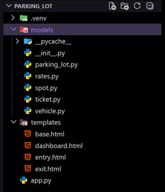
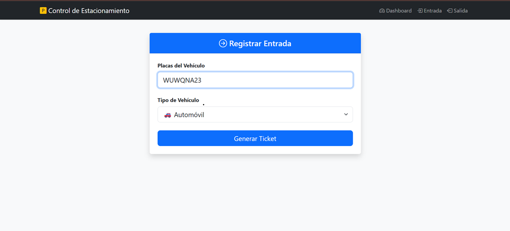
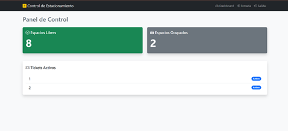
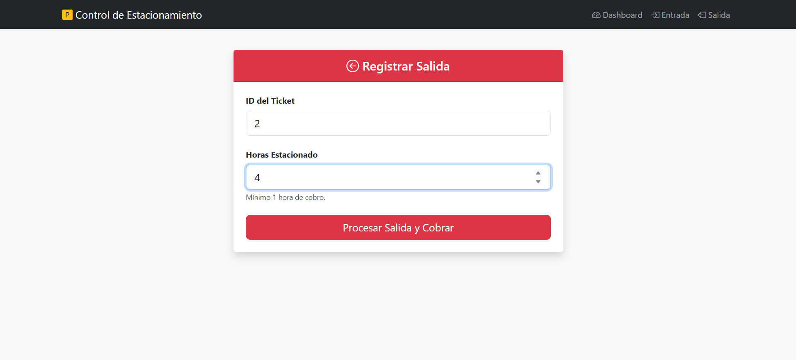
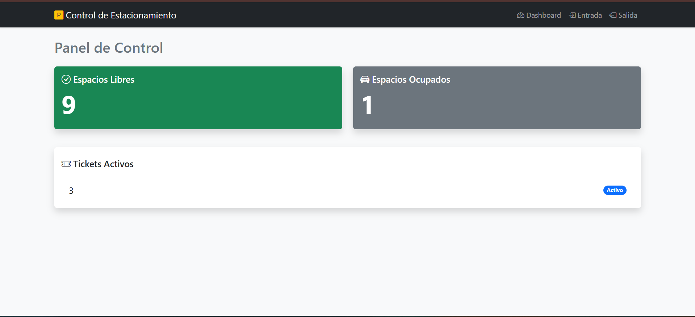

# Pracica 02 – Sistema de Estacionamiento con Flask y POO

## 1. Introducción

El problema que se aborda en este proyecto es la gestión de un estacionamiento. En muchos estacionamientos el control de entrada y salida de vehículos se realiza de forma manual, lo que puede provocar errores al asignar espacios.

El objetivo del sistema desarrollado es implementar una aplicación web sencilla que permita registrar la entrada de vehículos y asignarles un espacio disponible, generar un ticket y calcular el costo cuando el vehículo abandona el estacionamiento. Para lograrlo se aplicaron principios de Programación Orientada a Objetos (POO).

Este sistema permite:
- Registrar la entrada de vehículos.
- Asignar espacios disponibles según el tipo de vehículo.
- Generar y controlar tickets activos.
- Calcular el costo del estacionamiento.
- Visualizar el estado del estacionamiento.

## 2. Modelo del dominio

### Diagrama UML simple

            Vehicle
               ▲
               │
        ┌──────┴──────┐
        │             │
       Car        Motorcycle

    ParkingLot ───── Ticket ───── Vehicle
            
        │               │
        │               │
        └──── ParkingSpot

ParkingLot ───── RatePolicy
                    
                    ▲

                    │
               HourlyRate
               FlatRate

### Clases y responsabilidades

**Vehicle**  
Clase base que representa un vehículo. Define el comportamiento común.

**Car y Motorcycle**  
Subclases de Vehicle que representan distintos tipos de vehículos.

**ParkingSpot**  
Representa un espacio del estacionamiento y controla si está libre u ocupado.

**Ticket**  
Representa el ticket asignado a un vehículo al entrar al estacionamiento.

**ParkingLot**  
Es la clase principal del sistema. Administra los espacios, tickets y operaciones de entrada y salida.

**RatePolicy**  
Define la interfaz para calcular tarifas.

**HourlyRate / FlatRate**  
Implementaciones concretas de cálculo de tarifas.

## 3. Evidencia de conceptos POO

### Clase y objeto

Una clase define la estructura de un objeto. Por ejemplo:

```

class Vehicle:
def **init**(self, plates):
self._plates = plates

```

Un objeto es una instancia de la clase:

```

v = Car("ABC123")

```

### Encapsulación

La encapsulación protege el estado interno de los objetos mediante atributos privados.

Ejemplo del proyecto:

```

class Ticket:
def **init**(self, tid, vehicle, spot):
self._id = tid
self._vehicle = vehicle
self._spot = spot
self._active = True

```

El atributo `_active` no se modifica directamente sino mediante métodos:

```

def close(self):
self._active = False

```

Esto protege la integridad del estado del ticket.

### Abstracción

La abstracción permite definir comportamientos generales sin especificar su implementación.

Ejemplo:

```

class RatePolicy:
def calculate(self, hours, vehicle):
raise NotImplementedError

```

Esta clase define una interfaz de cálculo de tarifa pero no implementa el cálculo específico.

### Composición

La composición ocurre cuando una clase contiene otras clases como parte de su estructura.

En el sistema ParkingLot administra espacios y tickets.

```

class ParkingLot:
def **init**(self, spots, rate_policy):
self._spots = spots
self._tickets = {}
self._counter = 1
self._rate = rate_policy

```

Aquí `ParkingLot` contiene:

- ParkingSpot  
- Ticket  
- RatePolicy  

Esto permite que el estacionamiento gestione todo el sistema.

### Herencia

La herencia permite crear nuevas clases a partir de una clase base.

Ejemplo:

```

class Vehicle:
def **init**(self, plates):
self._plates = plates

class Car(Vehicle):
def get_type(self):
return "Car"

class Motorcycle(Vehicle):
def get_type(self):
return "Motorcycle"

```

Car y Motorcycle heredan de Vehicle.

### Polimorfismo

El polimorfismo permite tratar distintos objetos mediante una misma interfaz.

Ejemplo en el cálculo de tarifas:

```

cost = self._rate.calculate(hours, ticket.get_vehicle())

```

Aquí `self._rate` puede ser:

- HourlyRate  
- FlatRate  

Cada clase implementa su propia versión de `calculate`.

Ejemplo:

```

class HourlyRate(RatePolicy):
def calculate(self, hours, vehicle):
if vehicle.get_type() == "Car":
return hours * 20
else:
return hours * 10

```

## 4. Arquitectura MVC con Flask

El sistema utiliza el patrón Model-View-Controller (MVC) para organizar el código.

### Model

Contiene la lógica del sistema:

- ParkingLot  
- ParkingSpot  
- Vehicle  
- Ticket  
- RatePolicy  
- HourlyRate  
- FlatRate  

Estos archivos se encuentran en la carpeta **models**.

### View

Las vistas corresponden a los archivos HTML que muestran la interfaz:

- dashboard.html  
- entry.html  
- exit.html  

Estas páginas permiten interactuar con el sistema.


```

templates/
├ dashboard.html
├ entry.html
└ exit.html

```

### Controller

El controlador es el archivo principal de Flask que maneja las rutas.


```

@app.route("/")
def dashboard():
free, occ = lot.status()
tickets = lot.active_tickets()
return render_template("dashboard.html", free=free, occ=occ, tickets=tickets)

```

Rutas:

- `/base`
- `/dashboard`
- `/entry`
- `/exit`
  


Estas rutas controlan la lógica entre el modelo y la vista.

## 5. Pruebas manuales

### Flujo 1: Entrada de vehículo

1. Abrir el dashboard del sistema.  
2. Ir a la sección Entry.  
3. Ingresar placas del vehículo.  
4. Seleccionar tipo de vehículo.  
5. El sistema asigna un espacio disponible.  
6. Se genera un ticket activo.

Resultado esperado:

- El número de espacios ocupados aumenta.
- El ticket aparece como activo.



### Flujo 2: Salida del vehículo

1. Ingresar el número de ticket.  
2. Indicar horas de estacionamiento.  
3. El sistema calcula el costo.  
4. El ticket se cierra.  
5. El espacio se libera.

Resultado esperado:

- El costo se muestra en pantalla.
- El espacio vuelve a estar disponible.


## 6. Preguntas Guia

### 1. ¿Qué clase concentra la responsabilidad de asignar spots y por qué?

La clase **ParkingLot** concentra esta responsabilidad porque administra la colección de espacios (**ParkingSpot**) y decide cuál está disponible y puede recibir un vehículo.

### 2. ¿Qué invariantes protege tu modelo?

Dos invariantes importantes son:

- Un **ParkingSpot** solo puede estar libre o ocupado nunca ambos.
- Un **Ticket** solo puede estar activo mientras el vehículo está dentro del estacionamiento.

### 3. ¿Dónde se aplica polimorfismo y qué ventaja aporta?

El polimorfismo se aplica en el cálculo de tarifas mediante la interfaz **RatePolicy**. Esto permite cambiar la estrategia de cálculo sin modificar el resto del sistema.

### 4. ¿Qué parte pertenece a Model, View y Controller?

**Model:**  
Clases del sistema (ParkingLot, Ticket, Vehicle, etc.).

**View:**  
Archivos HTML que muestran la interfaz.

**Controller:**  
Archivo principal de Flask con las rutas.

### 5. Si cambian las tarifas, ¿qué clase modificarías?

Solo sería necesario modificar o crear una nueva clase que implemente **RatePolicy** como **HourlyRate**. Esto mantiene el resto del sistema sin cambios.

## 7. Conclusiones

La Programación Orientada a Objetos facilita el desarrollo de sistemas complejos al organizar el código en clases con responsabilidades claras. En este proyecto se aplicaron conceptos como encapsulación, herencia, abstracción y polimorfismo para construir un sistema modular y fácil de mantener.

El uso de interfaces como **RatePolicy** permite cambiar estrategias de cálculo sin afectar el resto del sistema lo que demuestra una ventaja importante de la POO: la extensibilidad. 

## Enlaces del proyecto

### Página estática del reporte

El reporte completo puede consultarse en la siguiente página:

[Ver página del proyecto](https://alxnd3r.github.io/PORTAFOLIO/)

### Repositorio de GitHub

El código fuente del proyecto se encuentra disponible en el siguiente repositorio:

[Ver repositorio en GitHub](https://github.com/ALXND3R/PORTAFOLIO)

## 8. Referencias

Gamma, E., Helm, R., Johnson, R., & Vlissides, J. (1994). *Design Patterns: Elements of Reusable Object-Oriented Software.* Addison-Wesley.

Lutz, M. (2013). *Learning Python (5th ed.).* O'Reilly Media.

Grinberg, M. (2018). *Flask Web Development: Developing Web Applications with Python.* O'Reilly Media.