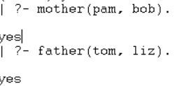
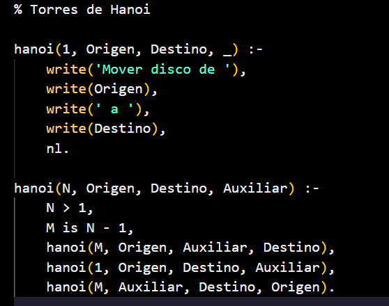
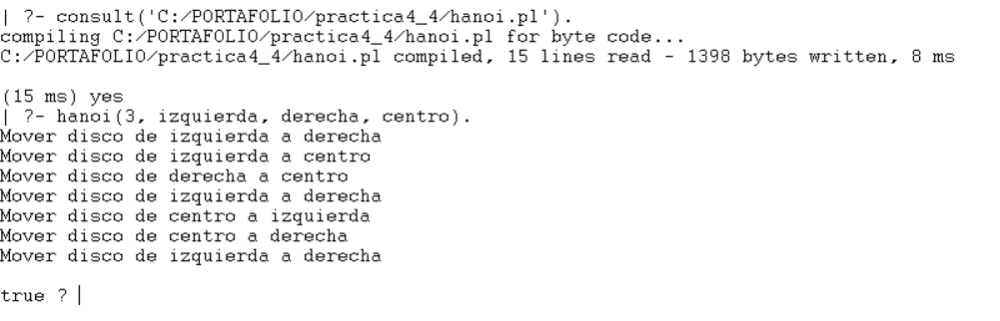
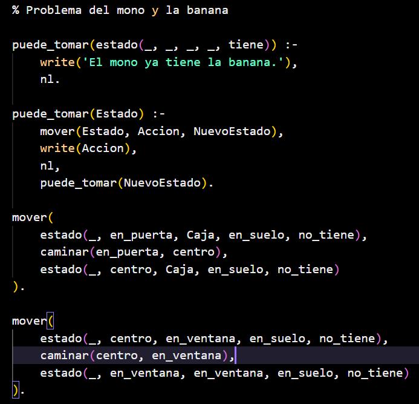
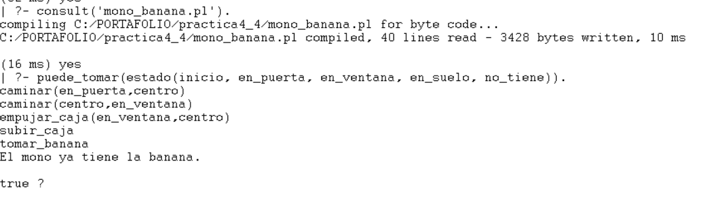

# Reporte de práctica 4: Paradigma lógico con Prolog


## Introducción

En esta práctica trabajé con el paradigma lógico utilizando el lenguaje Prolog. Al inicio me resultó diferente a otros lenguajes de programación porque en lugar de escribir instrucciones paso a paso Prolog se basa en declarar hechos, reglas y consultas.

En las sesiones fui comprendiendo que este paradigma se enfoca más en describir el conocimiento y dejar que el sistema encuentre respuestas mediante inferencia lógica. Durante la práctica instalé Prolog, realicé ejercicios, trabajé con listas y finalmente resolví los problemas de las Torres de Hanoi y el problema del mono y la banana.

---


## Instalación del entorno de desarrollo e introducción a Prolog

En la primera sesión realizé la instalación del entorno necesario para trabajar con Prolog. Después de instalarlo aprendí un poco a conocer la forma de escribir un programa de este lenguaje.

Lo primero que aprendí fue que Prolog trabaja con una base de conocimiento. Esta base se forma principalmente por hechos y reglas. Los hechos representan información que se considera verdadera mientras que las reglas permiten deducir nueva información a partir de esos hechos.

Al principio trabajé con ejemplos sencillos como declarar que una persona tiene ciertas característica o que existe una relación entre dos elementos. Esto me ayudó a entender la estructura básica de un hecho en Prolog.

Por ejemplo se utilizaron hechos similares a los siguientes:

    ```prolog
    cat(tom).
    loves_to_eat(jorge, pasta).
    lazy(juan).
    ```

Estos ejemplos permitieron observar que cada instrucción debe terminar con un punto y que los nombres de los predicados normalmente se escriben en minúsculas.


Al consultar un hecho existente Prolog respondía `true` y cuando el hecho no existía o no podía deducirse respondía `false`. Esto fue importante porque me permitió entender cómo el lenguaje evalúa la información dentro de la base de conocimiento.

---


## Programación con Prolog

En esta parte comencé a comprender mejor cómo se pueden representar relaciones entre objetos o personas, uno de los ejercicios principales fue el uso de relaciones familiares. Se declararon hechos para indicar parentescos entre varias personas y después se construyeron reglas para obtener relaciones más complejas como madre, padre, hermano o hermana.

Por ejemplo se trabajó con hechos parecidos a estos:

    ```prolog
    parent(pam, bob).
    parent(tom, bob).
    parent(bob, ann).
    parent(bob, pat).
    ```

Con ayuda de reglas fue posible deducir nuevas relaciones. Esto me ayudó a ver que Prolog no solo almacena información sino que también puede razonar con ella.




La recursión se utiliza para definir relaciones como antecesores, al principio parecía confuso pero después quedó más claro que la recursión sirve para repetir una relación hasta encontrar un caso base.

Revisé operadores aritméticos y de comparación para realizar operaciones básicas y comparación entre valores.

Algo que aprendí fue que en Prolog una lista puede dividirse en cabeza y cola lo que facilita recorrerla de forma recursiva. 

Esta sesión fue importante porque me permitió pasar de ejemplos básicos a estructuras más elaboradas. Poco a poco fui entendiendo que Prolog funciona como una red de conocimiento donde las respuestas se obtienen a través de relaciones lógicas.

---


## Aplicaciones con Prolog
                        
Aqui se aplicaron los conocimientos aprendidos en problemas más completos. Los principales problemas trabajados fueron las Torres de Hanoi y el problema del mono y la banana.

---

## Torres de Hanoi

El primer problema fue el de las Torres de Hanoi, este problema consistia en mover discos desde una torre origen hacia una torre destino utilizando una torre auxiliar.

Para resolverlo en Prolog se utilizó recursión. La idea principal fue dividir el problema en partes más pequeñas, primero mover los discos superiores después mover el disco más grande y finalmente mover los discos restantes a la torre destino.

En este ejercicio pude ver con más claridad cómo la recursión permite resolver problemas que parecen grandes pero que pueden dividirse en pasos repetitivos.

# Codigo


# Salida


La consulta utilizada permitió observar paso a paso los movimientos necesarios para resolver el problema. Esto me ayudó a entender que Prolog puede generar una solución siguiendo reglas lógicas sin necesidad de escribir manualmente cada movimiento.

---

## La banana y el mono

El segundo problema fue el del mono y la banana, este ejercicio  representa una situación donde un mono debe alcanzar una banana colgada pero para lograrlo el mono necesita moverse y tomar la banana.

Este problema fue útil para comprender cómo Prolog puede representar estados y acciones donde cada acción cambia el estado del problema hasta llegar al objetivo final.

En este caso el objetivo era que el mono terminara teniendo la banana. Para lograrlo Prolog evaluaba las posibles acciones hasta encontrar una secuencia válida.



Este ejercicio me permitió ver una aplicación más cercana a la resolución de problemas mediante inteligencia artificial básica ya que el programa no solo responde consultas simples sino que busca una secuencia de pasos para alcanzar una meta.



---

# Conclusión

En conclusion esta práctica me permitió conocer el paradigma lógico desde sus bases hasta su aplicación en problemas clásicos. Prolog me parecía un lenguaje extraño porque no sigue la misma lógica de programación a la que estaba acostumbrado pero sin embargo conforme avancé fui entendiendo que su fortaleza está en representar conocimiento y permitir que el sistema deduzca respuestas.

En conclusión Prolog es útil para resolver problemas donde se necesita razonar a partir de hechos y reglas. Esta práctica me ayudó a comprender mejor cómo funciona el paradigma lógico y cómo puede utilizarse para modelar situaciones, construir relaciones y encontrar soluciones mediante inferencia.

---

## Enlaces del proyecto

### Página estática del reporte

El reporte completo puede consultarse en la siguiente página:

[Ver página del proyecto](https://alxnd3r.github.io/PORTAFOLIO/)

### Repositorio de GitHub

El código fuente del proyecto se encuentra disponible en el siguiente repositorio:

[Ver repositorio en GitHub](https://github.com/ALXND3R/PORTAFOLIO)

---
# Referencias

Díaz, D. (s. f.). *GNU Prolog manual*. GNU Prolog. https://www.gprolog.org/manual/gprolog.html

Díaz, D. (s. f.). *The GNU Prolog web site*. GNU Prolog.    
https://www.gprolog.org/

Flach, P., & Sokol, K. (2022). *Simply logical: Intelligent reasoning by example*. 
https://book.simply-logical.space/

SWI-Prolog. (s. f.). *SWI-Prolog reference manual*.           
 https://www.swi-prolog.org/pldoc/refman/